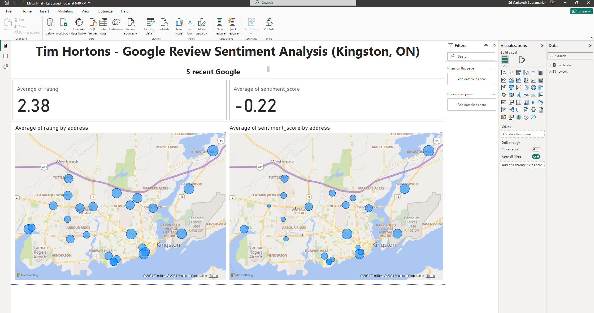

# Tim_Hotons_marketing_soln

 1. Web Scraped all Tim hortons Locations in Kingston, Ontario from Tim Hortons Website.
 2. Used Google Cloud's:
    - Map API to get the full Address and ID 
    - Places API to get Ratings and Reviews of each Tim Hortons Branch.
    - Language API to get the Sentment Score and Magnitude
    - Language API to get Moderation Values of each reviews.
1. Used firebase API to store the review text in firestore DB
2. Saved all values in a csv file
 3. Inserted values into PostegreSQL
  4. Used Power BI (datasource: PostgreSQL DB) to Visualize:
     - Ratings and Sentiment scores in a Geo Visual.
     - Distribution of Review Sentiment Score and Rating
     - Aggregated Moderation Values.  
---
# Comprehensive Analysis of Customer Feedback for Tim Hortons in Kingston, Ontario

This project undertakes a comprehensive analysis of customer feedback for Tim Hortons locations across Kingston, Ontario, by leveraging advanced data extraction and analysis techniques. The methodology encompasses several stages to ensure a thorough evaluation of sentiment and safety attributes (using moderation AI) in customer reviews.

## Here's a breakdown of the tasks completed:

### 1. Data Collection:
- Utilized web scraping techniques to compile a list of Tim Hortons locations from their official site.
- Obtained geographical coordinates for each location using the Google Maps API to facilitate precise analysis.

### 2. Review Analysis:
- Extracted five recent reviews for each location from Google Places API, focusing on the most current customer experiences.
- Employed Google Cloud Platform's sentiment analysis tools to assess the sentiment score and magnitude of each review, offering insights into customer emotions and the intensity of their opinions.
- Adapted Google Cloud's language AI for a novel application: instead of traditional moderation, we analyzed reviews for safety attributes. This approach allows us to gauge customer dissatisfaction or anger through specific indicators, transforming how we understand and respond to feedback.

### 3. Data Integration and Visualization:
- Established a connection to a PostgreSQL database using Python, enabling efficient data management and retrieval.
- Stored sentiment scores, magnitudes, and identified safety attributes in dedicated tables for structured analysis.
- Integrated review data into Firestore for enhanced accessibility and real-time analysis capabilities.
- Facilitated data-driven decision-making through a direct connection between the PostgreSQL database and Power BI, allowing for dynamic visualization of geolocation data, average sentiment scores, and magnitude for each Tim Hortons in Kingston.

## Marketing Implications

This project offers invaluable insights for marketing strategies at Tim Hortons. By analyzing real-time customer feedback, the brand can:

- **Identify Areas for Improvement:** Understanding sentiment scores and the intensity of customer emotions helps pinpoint specific areas needing attention, whether related to service, product quality, or overall customer experience.

- **Tailor Marketing Strategies:** Insight into customer sentiments and safety concerns enables the development of targeted marketing campaigns that address customer needs, build loyalty, and enhance brand reputation.

- **Proactively Manage Brand Image:** Analyzing safety attributes and indicators of customer dissatisfaction or anger allows Tim Hortons to address potential issues proactively, maintaining a positive brand image and customer trust.

- **Enhance Customer Engagement:** By addressing customer feedback effectively, Tim Hortons can foster a stronger connection with its customer base, encouraging repeat business and positive word-of-mouth.

---
## Screen Shots: 
PostgreSQL pgAdmin:

---
Firebase Firestore:

---
Page 1: 

Page 2:

Page 3:

Page 4:

---
ODBC Setup Windows for PowerBI: 

Power BI PgSQL Data Source:

---